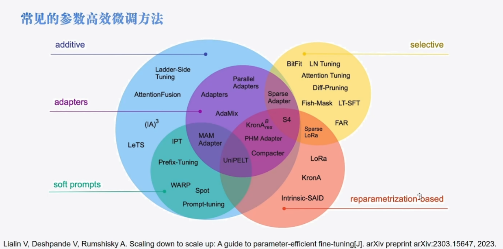
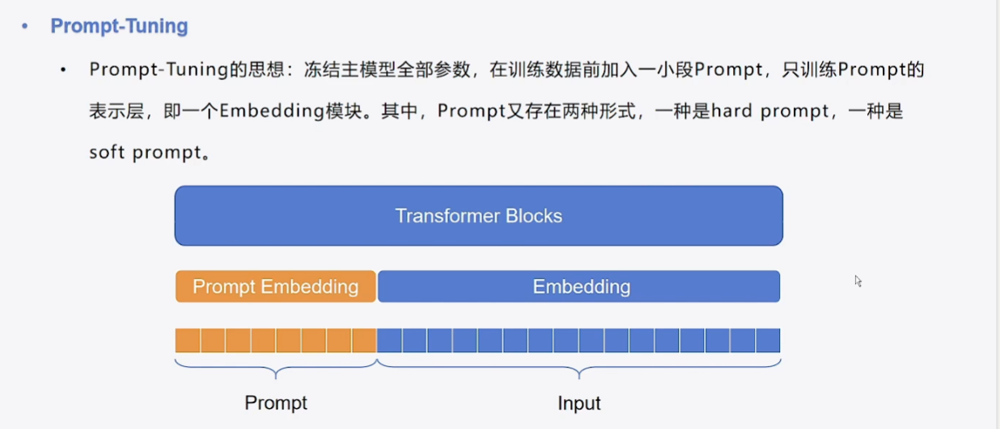
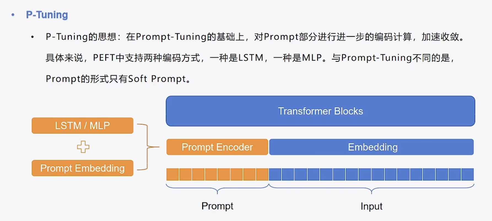
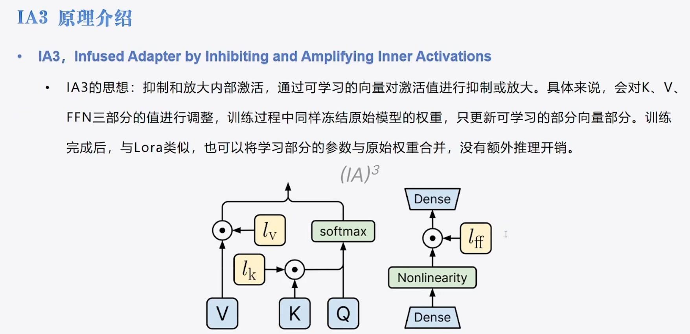

# 高效微调方法

本次介绍的内容是参数微调的方法，2018年BERT问世后，NLP任务的主流范式:预训练语言型 +微调。包括 **自编码模型、自回归模型、编码器解码器模型**，对于大多数模型的自我对比，尺寸越大，效果越好。预训练语言模型的趋势:大→ 更大→ 再大。BERT-Base只有0.1B，而现在意义上的大模型，起步就要6、7B更大的模型带来了更好的性能，但是也带来了一些问题。（1）以传统微调的方式对模型进行全量参数更新会消耗巨大的计算与存储资源；（2）个人层面，很难拥有充足的资源进行训练

在上述的情况下，参数**高效微调(Parameter-efficient fine-tuning，PEFT)**应运而生。

* 参数高效微调方法仅对模型的一小部分参数(这一小部分可能是模型自身的，也可能是外部引入的)进行训练便可以为模型带来显著的性能变化，一些场景下甚至不输于全量微调，颇有一种四两拨千斤的感觉
* 由于训练一小部分参数，极大程度降低了训练大模型的算力需求，不需要多机多卡，单卡即可完成对一些大模型的训练，不仅如此，少量的训练参数对存储的要求同样降低了很多，大多数的参数高效微调方法只需要保存训练部分的参数，与动辄几十GB的原始大模型相比，几乎可以忽略


如下图，高效微调方法如下：这些方法均可称为适配器



本次介绍的方法包括BitFIt、Prefix-Tuning、Prompt-tuning、LoRa、IA3、P-Tuning、Q-lora


## 一、BitFit

BitFit调参方法，主要是将模型中的非'bias'部分进行冻结，只更新'bias'部分的权重参数。如下代码。

```python
# bitfit
# 选择模型参数里面的所有bias部分
model = AutoModelForCausalLM.from_pretrained("./bloom-1b4-zh", low_cpu_mem_usage=True)
num_param = 0
for name, param in model.named_parameters():
    if "bias" not in name:
        param.requires_grad = False
    else:
        num_param += param.numel()

num_param
```

## 二、Prompt-tuning

Prompt-tunning 主要分为两张，第一种是hard prompt，这种主要是引导性的提示，需要给出文本。第二种是soft prompt这种没有给出提示，而是让模型自己学习。如下图，这种提示主要是在Embedding层加入新的可学习参数。



需要对参数做出一定解释：num_virtual_tokens表示是Prompt-Embedding的token数目，这里是10个；模型的任务选择的是CAUSAL_LM也就是生成文本类任务。PromptTuningInit.TEXT主要是表示这是一个Hard PROMPT；需要提供文本，如下，其次需要加入的num_virtual_tokens也就是我们提供的进行引导的这个文本的token数目。同时我们需要指定tokenizer模型。

```python
from peft import get_peft_model,PromptTuningConfig,PromptTuningInit,TaskType

# SOFT PROMPT 
# config = PromptTuningConfig(task_type=TaskType.CAUSAL_LM,num_virtual_tokens=10)
# model = get_peft_model(model,config)

# Hard PROMPT
config = PromptTuningConfig(task_type=TaskType.CAUSAL_LM,prompt_tuning_init=PromptTuningInit.TEXT,
                            prompt_tuning_init_text="下面是人和聊天机器人的对话。",
                            num_virtual_tokens=len(tokenizer("下面是人和聊天机器人的对话。")['input_ids']),
                            tokenizer_name_or_path='./bloom-1b4-zh')
model = get_peft_model(model,config)
# model.print_trainable_parameters()
```


## 三、P-Tuning

在Prompt-Tuning的基础上，对Prompt部分进行进一步的编码计算，加速收敛。具体来说，PEFT中支持两种编码方式，一种是**LSTM**，一种是**MLP**。与Prompt-Tuning不同的是，Prompt的形式只有Soft Prompt。P Tuning将Prompt转换为可以学习的Embedding层，并用MLP+LSTM的方式来对Prompt Embedding进行一层处理。



需要对参数做出一定解释：encoder_reparameterization_type指定采用的编码方式，encoder_num_layers指定中间层数，encoder_hidden_size指定每层的隐藏层单元个数。

```python
from peft import PromptEncoderConfig,TaskType,PromptTuningInit,get_peft_model,PromptEncoderReparameterizationType

config = PromptEncoderConfig(task_type=TaskType.CAUSAL_LM,num_virtual_tokens=10,
                             encoder_reparameterization_type=PromptEncoderReparameterizationType.LSTM,
                             encoder_dropout=0.1,encoder_num_layers=2,encoder_hidden_size=1024)
model = get_peft_model(model,config)
model.print_trainable_parameters()
```

## 四、Prefix-Tuning

.jpg)

需要对参数做出一定解释：prefix_projection是否投影前缀嵌入(token)，默认值为false；也就是是否加入这个MLP，如果加入那么就会多2个MLP层。

```python
from peft import PrefixTuningConfig,get_peft_model,TaskType
config = PrefixTuningConfig(task_type=TaskType.CAUSAL_LM,num_virtual_tokens=10,prefix_projection=True)
model = get_peft_model(model,config)
model.print_trainable_parameters()
```

其次，这个微调方法会在每层的K和V加入前缀，这个前缀也就是我们新加入的可学习参数。

.jpg)

## 五、LoRa

LoRa的训练思想如下，这个思想其实可以理解为整个高效微调方法的思想，也就是我们加入一些新参数、学习这些新参数。最后优化模型，但是有点不同的是，LoRa看似引入了新参数，但是最终是可以通过合并的方式解决这些‘新’参数。

.jpg)

如下图所示，我们需要优化的实际是旁路分支，而主干的模型参数是冻结的。最终模型微调好过后，可以通过参数合并，将其合并到原始模型，那么这个模型就是适应我们下游任务的模型。

.jpg)

需要对参数做出一定解释：target_modules表示对原始模型的哪些模块进行参数微调，有的生成模型官方确定好了需要微调的地方，但是可以修改，如下：官方指定的Bloom的微调模块是query_key_value，当然我们也可以添加自己想微调的地方。modules_to_save是指对原始模型哪些地方调整，这个调整是直接在原始模型基础上调整，而不是产生**低秩矩阵**。如何查看每个模型的name?可以通过打印模型网络结构解决。如何查看是否调整正确？可以打印模型的训练参数解决。

```python
from peft import  LoraConfig,TaskType,get_peft_model
# 打印模型参数名
for name,parmeters in model.named_parameters():
    print(name)
# target_modules
config  =LoraConfig(task_type=TaskType.CAUSAL_LM,
                    r=8,
                    #target_modules=["query_key_value","dense_4h_to_h"],
                   # modules_to_save=["word_embeddings"]
                    )
# 打印模型可训练参数
model.print_trainable_parameters()
```

lora模型的合并

```python
# 加在原始模型
model = AutoModelForCausalLM.from_pretrained('./bloom-1b4-zh',low_cpu_mem_usage=True)
# 加在lora微调模型
peft_model = PeftModel.from_pretrained(model=model,model_id='./Lora/checkpoint-100')
# 合并模型
merge_model = peft_model.merge_and_unload()
# 保存模型 ，此时保存好的模型，在下次加载时，可以直接通过from_pretrained记载
merge_model.save_pretrained('./merge_model')
```


## 六、IA3

如下图介绍，可以理解为在K、V和前向传播层之间加入可学习的参数。



需要对参数做出一定解释：target_modules表示对原始模型的哪些Q,K模块进行参数微调,feedforward_modules表示对原始模型的哪些前向传播层进行调整。

```python
from peft import IA3Config,TaskType,get_peft_model
config = IA3Config(task_type=TaskType.CAUSAL_LM,
                   target_modules = ['query_key_value'],
                   feedforward_modules =['mlp.dense_4h_to_h'])
```


## 七、Qlora


**模型加载与量化：** 当你开始训练时，QLoRA 并不会直接加载原始的 32-bit 模型。它会使用一种特殊的加载器，将 32-bit 权重**量化**成 **4-bit NormalFloat (NF4)** 格式。

**冻结原始模型：** 量化后的 4-bit 模型权重是**冻结**的，在训练过程中不会被修改。

**引入可训练参数：** QLoRA 会在模型的每一层（通常是注意力层的`q_proj`和`v_proj`）旁边，添加两个小的、低秩的矩阵（A和B）。这两个矩阵的参数就是**唯一可训练**的部分。

**前向传播** : 一个数据（比如你的文本输入）通过模型时，需要进行计算。计算不能在 4-bit 上直接进行。QLoRA 会**即时地（on-the-fly）\**将 4-bit 的权重\**解量化**回 16-bit 的 BFloat16 格式。这是一个非常高效的操作，不会成为瓶颈。 解量化后的 16-bit 权重会与输入数据进行矩阵乘法等运算。同时，可训练的 LoRA 矩阵 (A和B) 也会参与计算，其结果会加到原始矩阵的输出上。

**反向传播**：训练的目的是计算损失函数相对于参数的梯度。由于原始模型的权重是冻结的，所以**梯度只相对于 LoRA 矩阵 (A和B) 进行计算**。


参考：https://github.com/zyds

